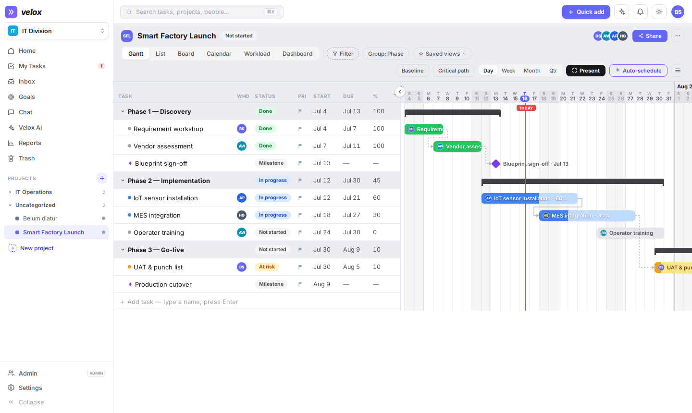
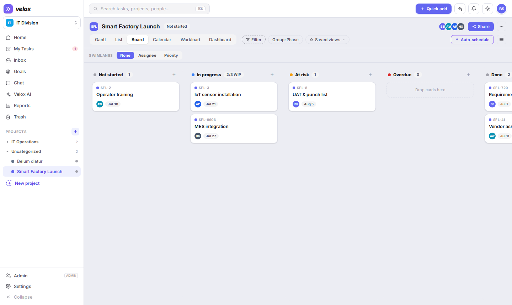
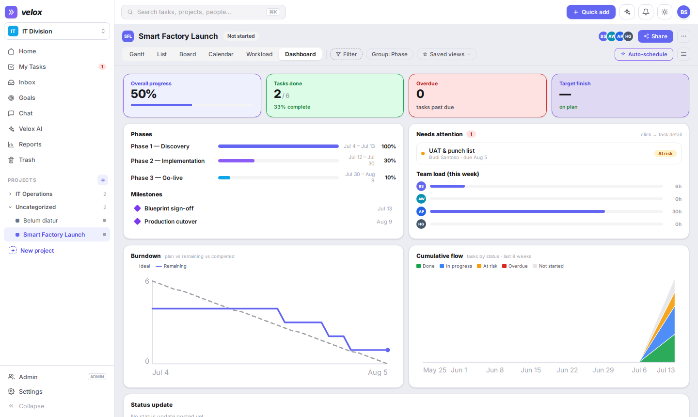
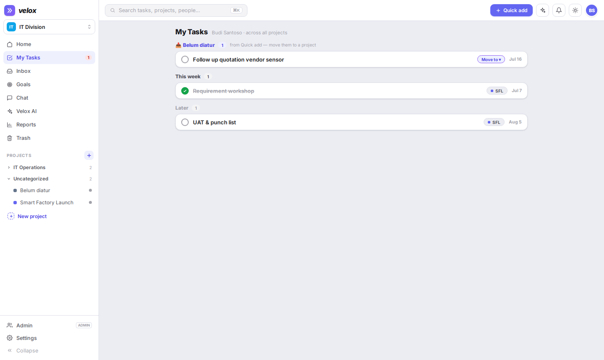
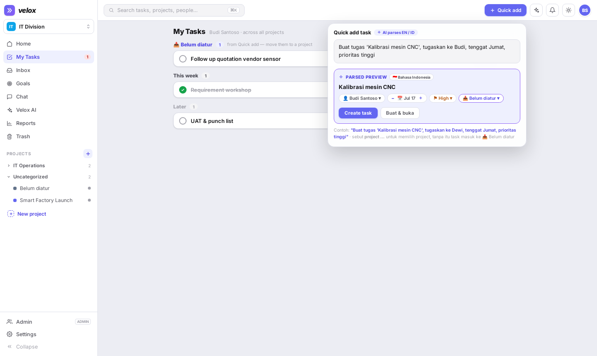
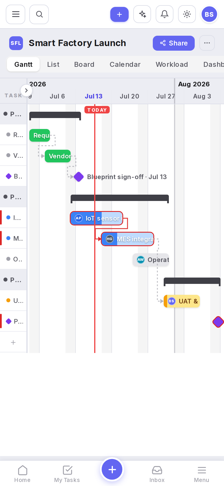
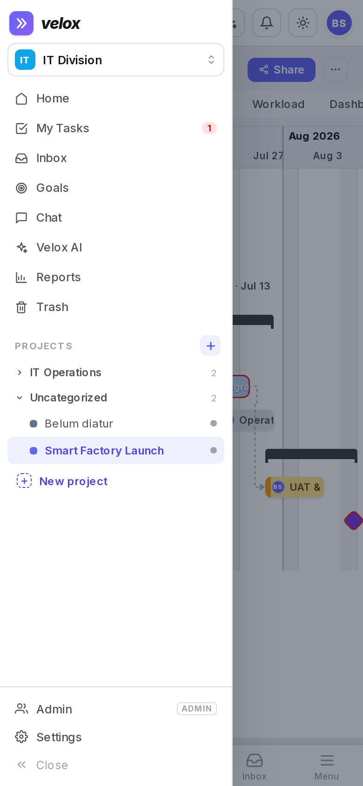

<p align="center">
  
</p>

<h1 align="center">Velox</h1>

<p align="center"><b>Swift, self-hosted project management</b> — Gantt-first planning, an AI copilot that speaks English <i>and</i> Bahasa Indonesia, and an MCP server so AI agents can work your projects for you.</p>

<p align="center">
  React 18 + Vite + Zustand · Express + Prisma + PostgreSQL · WebSocket realtime · Playwright-tested · PWA
</p>

---

## Screenshots

| Gantt — dependencies, critical path, milestones | Board — status columns & swimlanes |
| --- | --- |
|  |  |

| Project dashboard | My Tasks — quick-add triage inbox |
| --- | --- |
|  |  |

| AI Quick Add (English / Bahasa Indonesia) | Mobile PWA — Gantt & drawer |
| --- | --- |
|  |   |

## Why Velox instead of another PM tool?

| | Velox | Typical alternatives |
| --- | --- | --- |
| **Ownership** | Self-hosted on your own server — your data, your Postgres, no per-seat subscription | Asana / ClickUp / Monday charge per user per month; data lives on their cloud |
| **Planning depth** | Real Gantt: FS/SS/FF/SF dependencies with lag, critical path, baselines, auto-schedule, presentation mode | Trello has no Gantt; most tools gate dependencies/critical path behind top tiers |
| **AI, bilingual** | Type `Buat tugas 'Kalibrasi mesin CNC', tugaskan ke Dewi, tenggat Jumat, prioritas tinggi` — parsed into a task with assignee, due date and priority. English works too. Plus AI risk reports and a project copilot | AI add-ons are English-first and usually a paid extra |
| **AI-agent native** | Built-in **MCP server** (8 tools) with OAuth — connect Claude or any MCP client and let an agent query tasks, create work, post comments, pull risk reports | Rarely available; usually third-party bridges |
| **Zero-friction capture** | Quick Add from anywhere (⌘/Ctrl-K palette, topbar, mobile ➕) drops tasks into a **"Belum diatur"** triage inbox in My Tasks — capture first, organise later | Capture usually forces you to pick a project first |
| **Boardroom-ready exports** | One-click **Excel Gantt chart** (styled timeline, progress bars, critical path, milestones) + CSV + public read-only share links | Gantt exports are typically image-only or paywalled |
| **Mobile** | Installable PWA: bottom tab bar, drawer navigation, touch-sized rows, compact mobile Gantt, offline shell, web-push ready | Native apps exist for big vendors; self-hosted tools often desktop-only |
| **Lightweight** | Single Postgres + two containers; deploys with docker compose in minutes | Jira-class tools need heavy infrastructure and admin overhead |

**Honest fit:** Velox is built for small/medium teams who want deep scheduling and AI assistance without SaaS fees or data leaving their server. If you need ITSM ticketing, 1000-seat enterprise SSO/SCIM, or a marketplace of plugins, Jira-class suites still win.

## Feature list

### Planning & views
- **Gantt** — drag to move/resize bars, dependency drawing (FS/SS/FF/SF + lag), **critical path**, **baseline** ghosts, day/week/month/quarter zoom, phase grouping, milestone diamonds, TODAY marker, custom-field column, fullscreen **presentation mode**, one-click **auto-schedule**
- **List** — spreadsheet-style grid with inline editing and bulk edit (status/priority/assignee/section, up to 500 tasks)
- **Board** — status columns (Not started / In progress / At risk / Overdue / Done) with swimlanes by assignee or priority
- **Calendar**, **Workload** (weekly capacity per person), **Project dashboard** (progress, risk, activity)
- **Saved views**, filters, and per-project **sections**

### Tasks
- Subtasks (unlimited depth) with indent/outdent, milestones, checklists, labels, estimates, time logging
- **Custom fields** per project; **recurring tasks** (daily / weekly / monthly)
- Primary assignee + **multi-assignees** + watchers; **multi-homing** (one task shown in several projects)
- Rich-text descriptions, file attachments, threaded comments with reactions and **@mentions**
- Per-task **activity log** from the workspace audit trail
- **Trash with 30-day restore** for tasks and whole projects

### AI (Velox AI)
- **Natural-language Quick Add** in English and Bahasa Indonesia (server-side AI parse with local fallback): title, assignee, due date, priority, project — with an editable preview before creating
- **Delay-risk report** per project with causes and recommendations; overdue summaries
- Project copilot chat; AI writing polish for comments; AI alerts in the notification inbox

### Capture & personal flow
- **Quick Add everywhere** — topbar, ⌘/Ctrl-K command palette, mobile ➕; tasks without a stated project land in the per-workspace **"Belum diatur" inbox**, auto-assigned to you
- **My Tasks** — Overdue / Today / This week / Later, plus the triage group with one-tap **move-to-project**
- Command palette search across tasks, projects, people and actions

### Collaboration
- **Realtime** everything over WebSocket (presence, live task/board/gantt updates)
- Workspace **chat channels and DMs**, with task references
- Notification **inbox** (mentions / assignments / AI) + browser toasts with actions
- **Public read-only share links** per project (`/share/<token>`) — no login needed
- **OKR Goals** with key results; executive home dashboard; weekly **status updates**

### Reporting & export
- **Excel Gantt export** (.xlsx): styled task table + colored timeline, two-tone progress bars, critical path, milestones, weekend shading, frozen panes — print-ready landscape
- CSV export per project; full **workspace data export**; workspace **audit log**

### Mobile & PWA
- **Installable PWA** (Add to Home Screen on iOS/Android) with offline shell and web-push-ready service worker
- **Bottom tab bar** (Home · My Tasks · ➕ · Inbox · Menu), off-canvas drawer, compact mobile Gantt (Task/Who/Status + always-visible collapse chevron), full-width quick-add sheet, touch-sized rows

### Governance & security
- Roles: OWNER / ADMIN / MANAGER / MEMBER / GUEST / EXEC_VIEWER (read-only exec mode)
- **TOTP two-factor auth**, JWT access + rotating refresh tokens, per-route rate limits
- Project privacy (workspace / hidden), archiving, project **templates** & duplication, workspace categories
- Bilingual UI (**English / Bahasa Indonesia**), light/dark/system themes, accent colors, comfortable/compact density

### Integrations & API
- **Public REST API `/api/v1`** — API keys (`vlx_live_…`) with granular scopes and per-key rate limits
- **Webhooks** with an event catalog and per-hook secrets
- **No-code automations** — WHEN *trigger* → THEN *action* rules per workspace
- **MCP server** for AI agents (OAuth 2.0): `list_projects`, `query_tasks`, `create_task`, `update_task`, `update_task_status`, `post_comment`, `get_risk_report`, `get_overdue_summary`

## Architecture

```
web/      React 18 + Vite + Zustand SPA (inline-styled design system, i18n EN/ID)
          └─ nginx serves the build and proxies /api + /ws
server/   Express + Prisma + PostgreSQL, WebSocket hub, schedulers
          └─ auth (JWT+refresh, TOTP), authz roles, audit, AI endpoints,
             public API v1, webhooks, MCP + OAuth server
e2e/      Playwright suite (desktop + mobile + PWA smoke, 23 tests)
docs/     screenshots & assets
```

- Dates are stored as integer day-indexes from a fixed epoch — timezone-proof scheduling math.
- Optimistic UI writes with server reconciliation; live events fan out per workspace.
- Everything ships as two Docker containers (`velox-web`, `velox-server`) plus Postgres.

## Getting started

**Development** — see [README-DEV.md](README-DEV.md)

```bash
docker compose up -d          # postgres + api + vite dev server
```

**Production** — see [DEPLOY.md](DEPLOY.md)

```bash
cp docker-compose.prod.example.yml docker-compose.prod.yml   # fill in secrets
docker compose -f docker-compose.prod.yml up -d --build
```

**Tests**

```bash
cd e2e && npm install && npx playwright install --with-deps chromium
npm test        # 23 E2E tests against BASE_URL (desktop + mobile + PWA)
```

## Design lineage

The UI began as a high-fidelity prototype in Claude Design (`project/`, `chats/` keep the original handoff bundle) and was implemented into this production codebase, then extended well beyond the prototype: real auth, realtime, AI endpoints, public API, MCP, PWA and the mobile experience.
